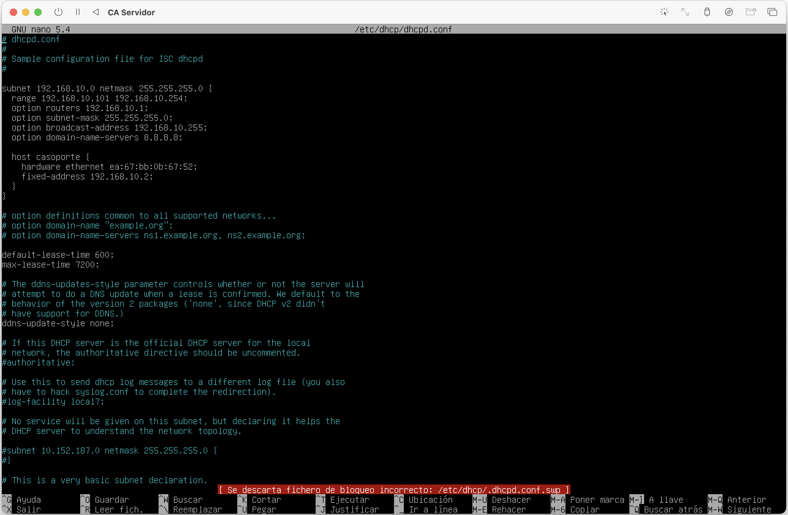
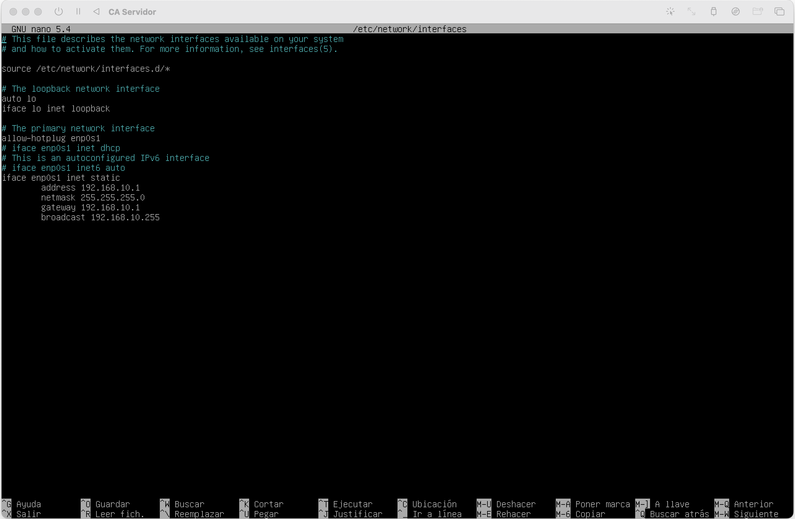
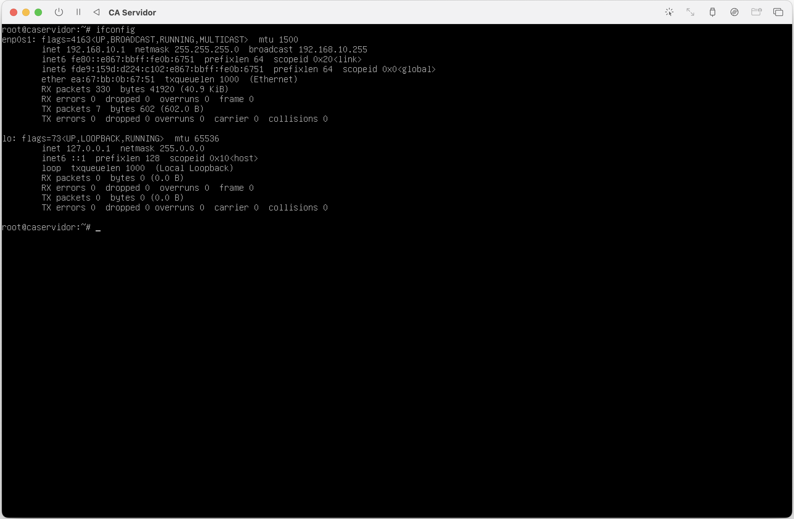
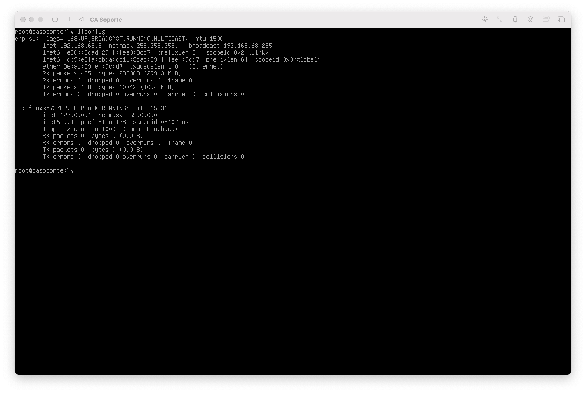
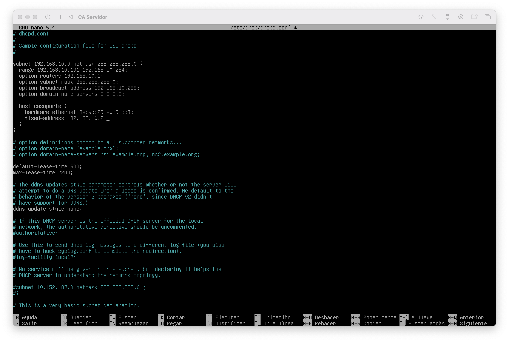
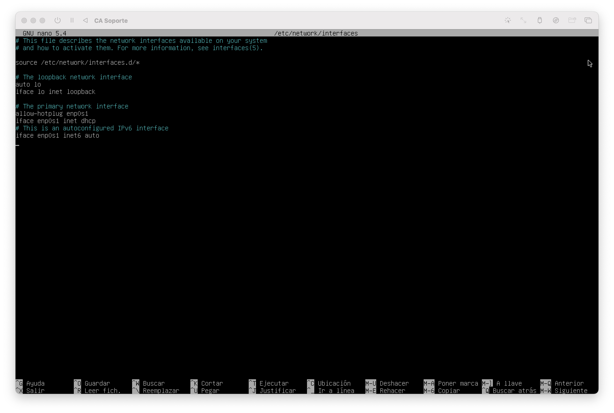
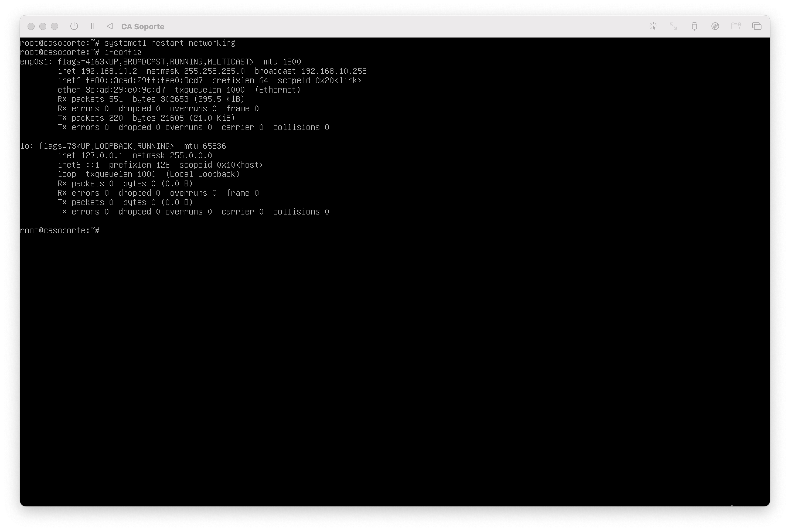

### (2024-2C) Computación Aplicada
# TP Integrador

## Grupo 1
- Paz Lucas
- Paz Luciano
- Rodriguez Carmauta Gabriel Jesus
- Romero Garcia Juan Cruz
- Taphanel Facundo
- Escudero Mauro Joaquin

<div style="page-break-after: always; visibility: hidden"> 
\newpage 
</div>

# Instalación de CAServidor

## Instalación de la VM

Crear una VM e instalar la imagen de Debian 11.10.

En nombre de la máquina indicar `caservidor`.

## Instalación de servidor SSH

En la vm `caservidor` (usando el usuario root):

1. Instalar el servidor SSH con `apt`:
```bash
apt install openssh-client
```

2. Obtener la IP de la vm:
```bash
ip addr show
```

3. Comprobar desde local o otra vm que está funcionando correctamente:
```bash
ssh usuario-caservidor@ip-vm
```
_Reemplazar `usuario-caservidor` con el nombre del usuario de la vm `caservidor`<br/>y reemplazar `ip-vm` con la ip obtenida en el paso anterior_

## Instalación y configuración del DHCP

En la vm `caservidor` (usando el usuario root):

1. Instalar el servidor DHCP y net tools con `apt`:
```bash
apt install isc-dhcp-server net-tools
```

<div style="page-break-after: always; visibility: hidden"> 
\newpage 
</div>

2. Crear el archivo `/etc/default/isc-dhcp-server` con el siguiente contenido:
```
INTERFACES="enp0s1"
```

3. Agregar al archivo `/etc/dhcp/dhcpd.conf` el siguiente contenido:<br/>
_(la mac address `00:00:00:00:00:00` debe ser reemplazada con la de la vm de `casoporte`)_
```
subnet 192.168.10.0 netmask 255.255.255.0 {
  range 192.168.10.101 192.168.10.254;
  option routers 192.168.10.1;
  option subnet-mask 255.255.255.0;
  option broadcast-address 192.168.10.255;
  option domain-name-servers 8.8.8.8;
}
```
Debe quedar como la siguiente imagen:


<div style="page-break-after: always; visibility: hidden"> 
\newpage 
</div>

4. Agregar al archivo `/etc/network/interfaces` el siguiente contenido:
```
iface enp0s1 inet static
    address 192.168.10.1
    netmask 255.255.255.0
    gateway 192.168.10.1
    broadcast 192.168.10.255
```
Debe quedar como la siguiente imagen:


5. Iniciar el servidor DHCP:
```bash
systemctl start isc-dhcp-server
systemctl enable isc-dhcp-server
```

6. Confirmar con `ifconfig` que la vm haya tomado la ip correcta:
```bash
ifconfig
```
Se debe visualizar como la siguiente imagen:


# Instalación de CASoporte

## Instalación de la VM

Crear una VM e instalar la imagen de Debian 11.10.

En nombre de la máquina indicar `casoporte`.

## Configuración del cliente DHCP

En la vm `casoporte` (usando el usuario root):

1. Instalar net tools con `apt`:
```bash
apt install net-tools
```

2. Obtener MAC address con `ifconfig`:
```bash
ifconfig
```
Se visualiza la siguiente información:

Se debe copiar el valor del campo `ether` que es la MAC address de la VM. En este caso sería `3e:ad:29:e0:9c:d7`.

3. Se debe volver a la VM `caservidor` con usuario root y editar el archivo `/etc/dhcp/dhcpd.conf` dejándolo con el siguiente contenido:<br/>
_(la mac address `00:00:00:00:00:00` debe ser reemplazada con la de la vm de `casoporte` obtenida en el paso anterior)_
```
subnet 192.168.10.0 netmask 255.255.255.0 {
  range 192.168.10.101 192.168.10.254;
  option routers 192.168.10.1;
  option subnet-mask 255.255.255.0;
  option broadcast-address 192.168.10.255;
  option domain-name-servers 8.8.8.8;

  host casoporte {
    hardware ethernet 00:00:00:00:00:00;
    fixed-address 192.168.10.2;
  }
}
```
Debe quedar como la siguiente imagen:


4. Reiniciar el servicio DHCP en la VM `caservidor`:
```bash
systemctl restart isc-dhcp-server
```

5. Volver a la VM de `casoporte` con el usuario root y editar el archivo `/etc/network/interfaces` para utilizar el DHCP:
```
iface enp0s1 inet dhcp
```
Debe quedar como la siguiente imagen:


6. Reiniciar el servicio de conexión:
```bash
systemctl restart networking
```

7. Validar que la conexión fue establecida correctamente con `ifconfig`:
```bash
ifconfig
```
Se visualiza la siguiente información:


# Instalación de CACTesoreria01 y CACTesoreria02

## Instalación de la VM

Crear una VM e instalar la imagen de Debian 11.10.

En nombre de la máquina indicar `cactesoreria01` y `cactesoreria02`.

## Configuración del cliente DHCP

En la vm `cactesoreria01` y `cactesoreria02` (usando el usuario root):

1. Instalar net tools con `apt`:
```bash
apt install net-tools
```

<div style="page-break-after: always; visibility: hidden"> 
\newpage 
</div>

2. Editar el archivo `/etc/network/interfaces` para utilizar el DHCP:
```
iface enp0s1 inet dhcp
```

3. Reiniciar el servicio de conexión:
```bash
systemctl restart networking
```

4. Validar que la conexión fue establecida correctamente con `ifconfig`:
```bash
ifconfig
```

# Script de sincronización (WIP)

```bash
#!/bin/bash

# Funcion que devuelve la hora actual en formato UTC.
# Ejemplo: 2021-05-14_16-26-31Z
function now() {
  date -u +"%Y-%m-%d_%H-%M-%S"Z
}

#Toma el directorio actual como base de ejecucion
BASEDIR=$(dirname "$0")
#Toma el nombre de este mismo script
BASENAME=$(basename -- "$0")
#Compone los paths de logs
LOGDIR=$BASEDIR/$BASENAME'.logs'
LOGFILE=$LOGDIR/$BASENAME'_'`now`.log
ORIGEN=/home
DESTINO=/media/backups

#Funcion que escribe los logs
function writelog() {
	echo "$BASENAME: $(now) - $1" >&1 | tee -a $LOGFILE
}


# Se valida la existencia del directorio de logs. Se crea en
# caso de ser necesario
if [ ! -d $LOGDIR ]; then
	mkdir $LOGDIR
fi

writelog "--------------------------------------"
writelog "--Iniciando script de sincronización--"
writelog "--------------------------------------"

# Se indican los argumentos obligatorios que recibira rsync
#-v: modo verbose muestra que va haciendo
#-r: lo hace recursivamente
#-z: comprime durante la transferencia
#-a: copia todo incluidos links simbolicos
ARGUMENTOSRSYNC=-vrza

# Se indican los argumentos opcionales que recibira rsync
# Aca verifico si tengo un argumento 
if [ $# -eq 1 ]; then
  archivo_exclusiones="$1"
  writelog "Argumento de exclusiones detectado, leyendo exclusiones..."
  # Verifica si el archivo existe
  if [ ! -f "$archivo_exclusiones" ]; then
    writelog "El archivo de exclusiones indicado '$archivo_exclusiones' no existe."
    exit 1
  fi
  # Construir las opciones --exclude para rsync
  while read -r linea; do
    ARGUMENTOSRSYNC+=" --exclude '$linea'"
  done < "$archivo_exclusiones"
fi

ARGUMENTOSRSYNC+="$ORIGEN/"
ARGUMENTOSRSYNC+="$DESTINO/"

writelog "Los argumentos finales para rsync son: $ARGUMENTOSRSYNC"

# Se arma la ejecucion de rsync. Se indican argumentos, origen,
# destino y se envian las salidas std y err al archivo de log
#rsync $ARGUMENTOSRSYNC
exit 0
```