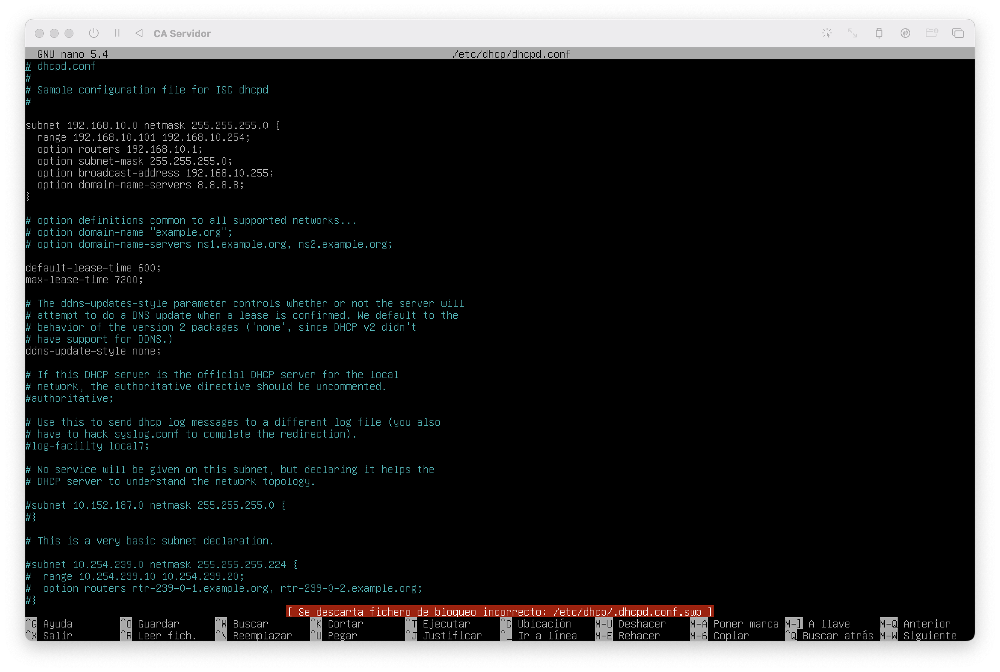

### (2024-2C) Computación Aplicada
# TP Integrador

## Grupo 1
- Paz Lucas
- Paz Luciano
- Rodriguez Carmauta Gabriel Jesus
- Romero Garcia Juan Cruz
- Taphanel Facundo
- Escudero Mauro Joaquin

<div style="page-break-after: always; visibility: hidden"> 
\newpage 
</div>

## Instalación de servidor SSH

En la vm `caservidor` (usando el usuario root):

1. Instalar el servidor SSH con `apt`:
```bash
apt install openssh-client
```

2. Obtener la IP de la vm:
```bash
ip addr show
```

3. Comprobar desde local o otra vm que está funcionando correctamente:
```bash
ssh usuario-caservidor@ip-vm
```
_Reemplazar `usuario-caservidor` con el nombre del usuario de la vm `caservidor`<br/>y reemplazar `ip-vm` con la ip obtenida en el paso anterior_

## Instalación y configuración del DHCP

En la vm `caservidor` (usando el usuario root):

1. Instalar el servidor DHCP y net tools con `apt`:
```bash
apt install isc-dhcp-server net-tools
```

2. Crear el archivo `/etc/default/isc-dhcp-server` con el siguiente contenido:
```
INTERFACES="enp0s1"
```

1. Agregar al archivo `/etc/dhcp/dhcpd.conf` el siguiente contenido:<br/>
_(la mac address `00:00:00:00:00:00` debe ser reemplazada con la de la vm de `casoporte`)_
```
subnet 192.168.10.0 netmask 255.255.255.0 {
  range 192.168.10.101 192.168.10.254;
  option routers 192.168.10.1;
  option subnet-mask 255.255.255.0;
  option broadcast-address 192.168.10.255;
  option domain-name-servers 8.8.8.8;

  host casoporte {
    hardware ethernet 00:00:00:00:00:00;
    fixed-address 192.168.10.2;
  }
}
```
Debe quedar como la siguiente imagen:


4. Agregar al archivo `/etc/network/interfaces` el siguiente contenido:
```
iface enp0s1 inet static
    address 192.168.10.1
    netmask 255.255.255.0
    gateway 192.168.10.1
    broadcast 192.168.10.255
```
Debe quedar como la siguiente imagen:


5. Reiniciar el servidor DHCP:
```bash
systemctl restart isc-dhcp-server
```

6. Confirmar con `ifconfig` que la vm haya tomado la ip correcta:
```bash
ifconfig
```
Se debe visualizar como la siguiente imagen:
